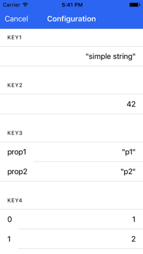

# ionic-configuration-viewer

**The dependencies used by the latest version are the same as needed for [Ionic 3.0.0](https://github.com/driftyco/ionic/blob/master/CHANGELOG.md). For older versions use:**

- **Ionic 2.0.0: version 1.2.1.**
- **Ionic 2.2.0: version 3.0.0.**

[](https://travis-ci.org/Ritzlgrmft/ionic-configuration-viewer)
[](https://codecov.io/gh/Ritzlgrmft/ionic-configuration-viewer)
[](https://www.npmjs.com/package/ionic-configuration-viewer)
[](https://www.npmjs.com/package/ionic-configuration-viewer)
[](https://david-dm.org/ritzlgrmft/ionic-configuration-viewer/master)
[](https://david-dm.org/ritzlgrmft/ionic-configuration-viewer/master?type=peer)
[](https://david-dm.org/ritzlgrmft/ionic-configuration-viewer/master?type=dev)
[](http://commitizen.github.io/cz-cli/)
[](https://snyk.io/test/github/ritzlgrmft/ionic-configuration-viewer)
[](https://www.npmjs.com/package/ionic-configuration-viewer)

The configuration viewer is a small component which can be used in your [Ionic app](https://github.com/driftyco/ionic)
for displaying the current configuration data, provided by [ionic-configuration-service](https://github.com/Ritzlgrmft/ionic-configuration-service).
The viewer is meant for development and testing purposes, not for production.

It provides 2 components:

- `ConfigurationViewerComponent`:  
  can be embedded in any web page using the directive
- `ConfigurationViewerModalComponent`:  
  a complete implemented modal containing the `ConfigurationViewerComponent`

A sample app using these components is [ionic-configuration-sample](https://github.com/Ritzlgrmft/ionic-configuration-sample).

## Screenshots

| Configuration Modal |
| ---------- |
|  |

## Usage

### npm package

```bash
npm install ionic-configuration-viewer --save
```

### import module

Import the `ConfigurationViewerModule` in to your `app.module.ts`:

```typescript
import { ConfigurationViewerModule } from "ionic-configuration-viewer";
...
@NgModule({
  imports: [
    IonicModule.forRoot(AppComponent),
    ConfigurationViewerModule
  ],
  ...
})
```

### ConfigurationViewerComponent directive

If you want to use the directive in one of your pages, just add

```html
<ionic-configuration-viewer></ionic-configuration-viewer>
```

### ConfigurationViewerModalComponent modal

For sure, you can do the whole modal stuff by your own.
But for your convenience, the is also the `ConfigurationViewerModalManager`,
which you can get injected in your code:

```typescript
constructor(
  private configurationViewerModalManager: ConfigurationViewerModalManager) {
    this.configurationViewerModalManager.modalClosed.subscribe(() => {
      // modal closed
  });
}

public openModal(): void {
  this.configurationViewerModalManager.openModal();
}
```

**Currently, there is a problem with Ionic production builds (`--prod` argument).
Therefore you have to disable the tree shaking in your app, when you want to use the modal.**

For disabling tree shaking, just add the following configuration to your `package.json`:

```json
"config": {
  "ionic_manual_treeshaking": false
},
```

### multi language support

The `ConfigurationViewerComponent` does not need multi language support, since it just
displays the configuration data.

But for the `ConfigurationViewerModalComponent`, multi language support is needed,
since the modal contains some translatable texts. Therefore,
`configurationViewerModalManager.openModal()` has a `language` parameter, which you can
use to select the language. Currently `en` and `de` are supported.

If you need another language, either open an issue, or just the `translation` parameter.
This parameter you can use to pass your completely own texts.
Just fill the `ConfigurationViewerTranslation` object.

## API

### openModal(language: string = undefined, translation: ConfigurationViewerTranslation = undefined): Promise&lt;void>

Opens the modal.

Parameters

- *language*: language used for the modal (currently only `en` or `de`).
  If *tranlation* is passed as well, the language will be ignored.
- *translation*: custom values for the translatable texts.

Returns

- Promise which gets resolved as soon as the modal is shown.

Example

```typescript
manager.openModal(undefined, { title: "ttt", buttonCancel: "bc" })
  .then(() => {
  });
```

### modalClosed: new EventEmitter&lt;void>

Event triggered when the modal was closed..
